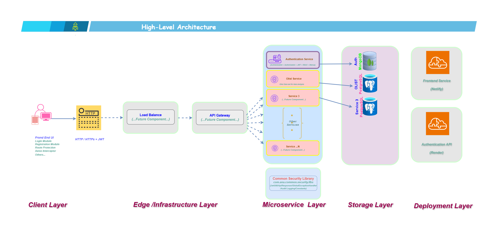
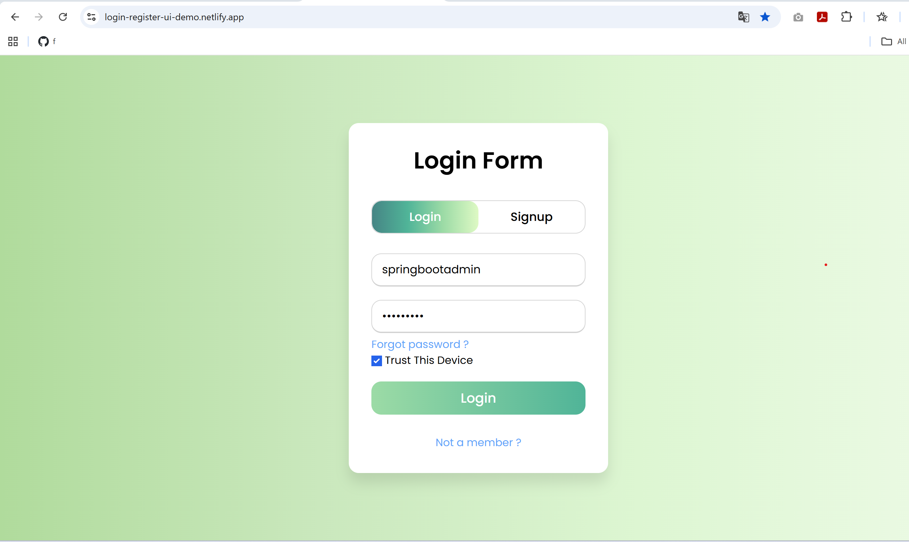
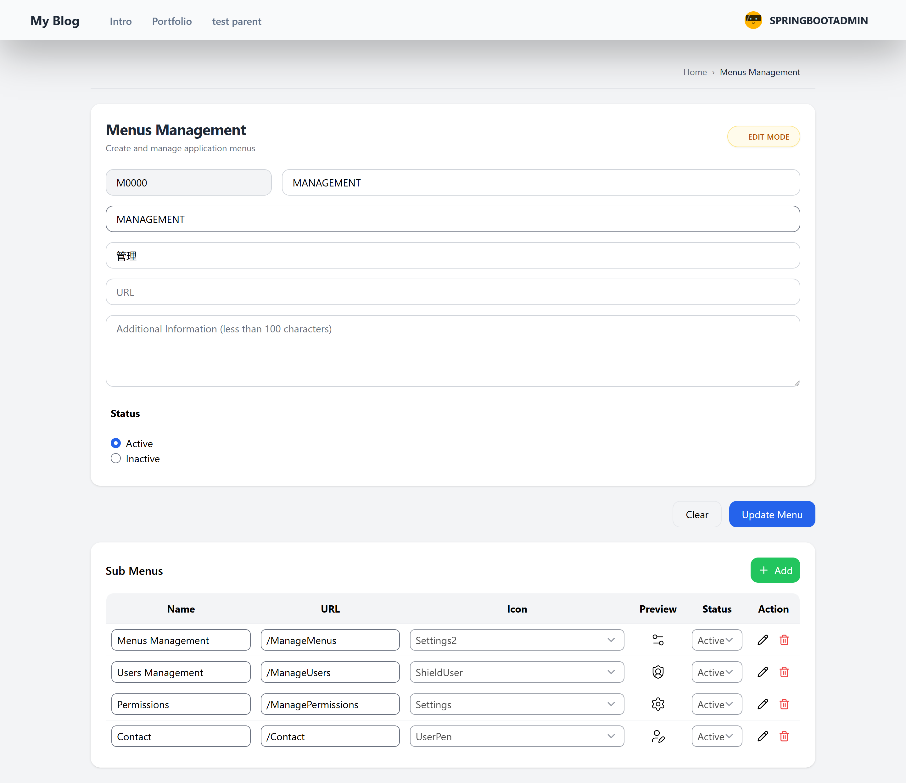
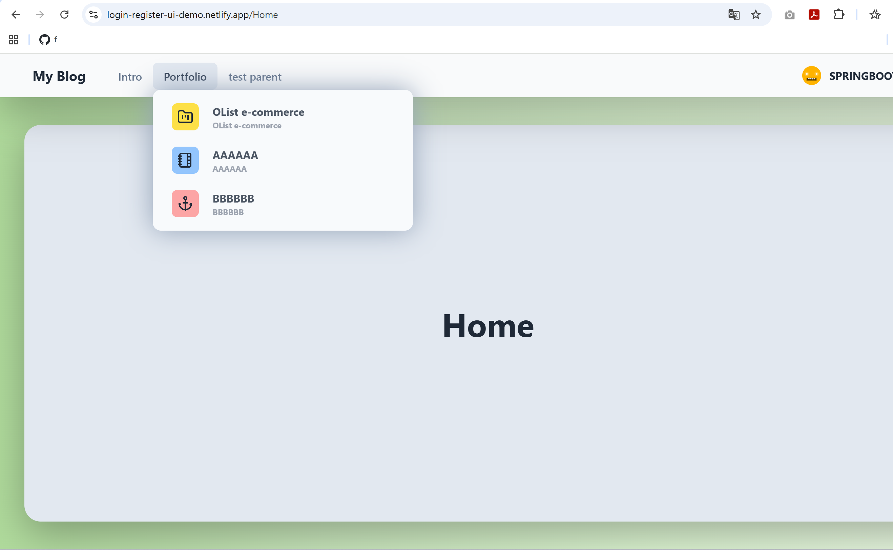
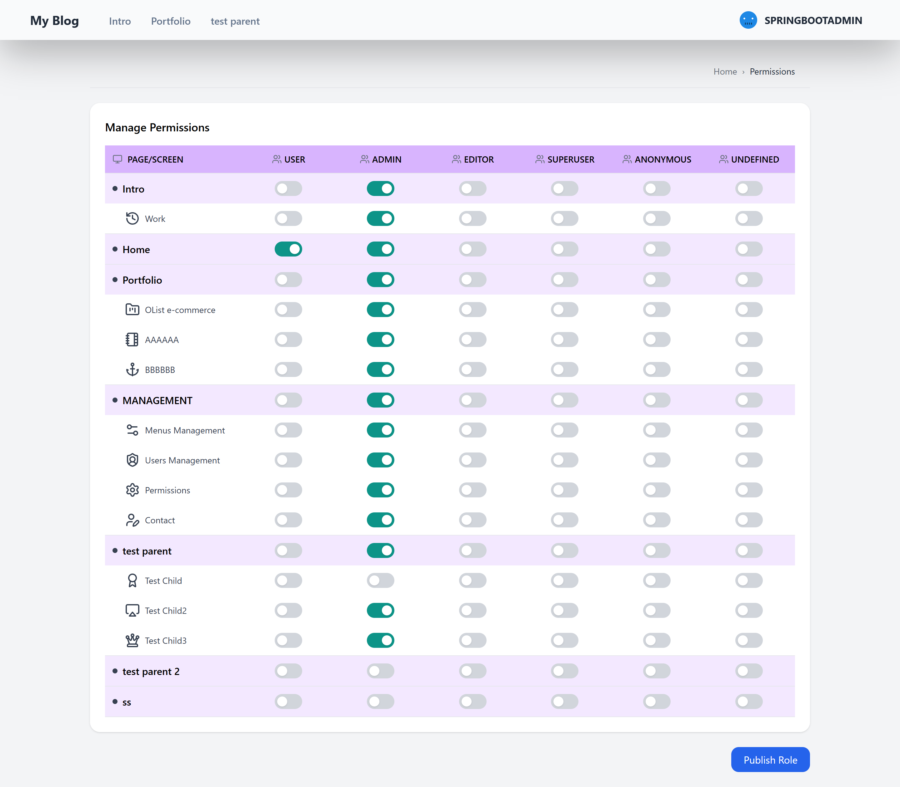

# React Login & Register UI (Vite)


## 📌 Overview
This project is a frontend application built with React for user authentication (Login & Register).

It is designed as part of my learning journey to understand how frontend applications interact with backend authentication systems, especially JWT-based authentication.

The goal of this project is to practice building clean UI, handling form validation, and integrating with real backend APIs.

## 🏗 High-Level Architecture 

This diagram provides an overview of the application's architecture, showing how the React frontend communicates with the Spring Boot backend through REST APIs, using JWT-based authentication and MongoDB for data persistence.




## 🧩 Features  
  
- Responsive Login & Register UI
- Clean and simple UI design
- Form validation handling
- Reusable React components
- Clean folder structure for scalability
- Mobile-friendly layout
- Fast development setup with Vite
- Integrate with backend (JWT Authentication)  
 

## 🛠 Tech Stack

- TypeScript (.ts)
- React + TypeScript (.tsx)
- Tailwind CSS
- Vite
- Heroicons React
- Lucide React
- Font Awesome
- Netlify (Free-tier Deployment)


## 📦 Installation

```bash
rm -rf node_modules
rm package-lock.json

npm install
npm install -D tailwindcss postcss autoprefixer
```

 ***Remark : Vite is required as a build tool when using React, because React cannot run directly in the browser like plain HTML. </a>***
    

## 🚀 Integration History 

- Initial backend implementation using Express.js JWT Authentication:  
  
    
  <a href="https://github.com/Thiraporn/expressjs_authenjwtswithmongodb" target="_blank">
  Express.js Backend Repository
  </a>|<a href="https://expressjs-authenjwtswithmongodb.onrender.com" target="_blank">
  API Health Check
  </a>
  <br/>  
  <br/>  
- Integrated and migrated authentication system to Spring Boot Security with JWT:   
  
    
  <a href="https://github.com/Thiraporn/SpringBoot_AuthenWithJWTs" target="_blank">
    Spring Boot Backend Repository
  </a>|<a href="https://springboot-authenjwtswithmongodb.onrender.com" target="_blank">
    API Health Check
  </a> 
  <br/>  
  <br/> 
- Frontend React Application:  
   
    
  <a href="https://github.com/Thiraporn/react_login_register" target="_blank">
  This Repository
  </a>|<a href="https://login-register-ui-demo.netlify.app" target="_blank">
  View Demo
  </a>
  <br/>  
  <br/> 
 
 ## 🖼️ Sample Screens

 
###  🔑 Login

User authentication page with JWT-based login and role-based access control.
 


###  🗂️ Menu Management 
  
Manage application menus and submenus dynamically through the administration panel.



### 🧭 Navigation Preview

After creating a menu, users can view the menu hierarchy by hovering over the navigation bar.



### 🛡️ Role & Permission Management

Configure role-based permissions and control user access to system features.




<!--deploy react UI on netlify  https://app.netlify.com/projects/login-register-ui-demo/overview  user github -->

 

<!-- # Remark 
This project has been migrated from normal CRA  to Vite (On 23/2/2026) -->